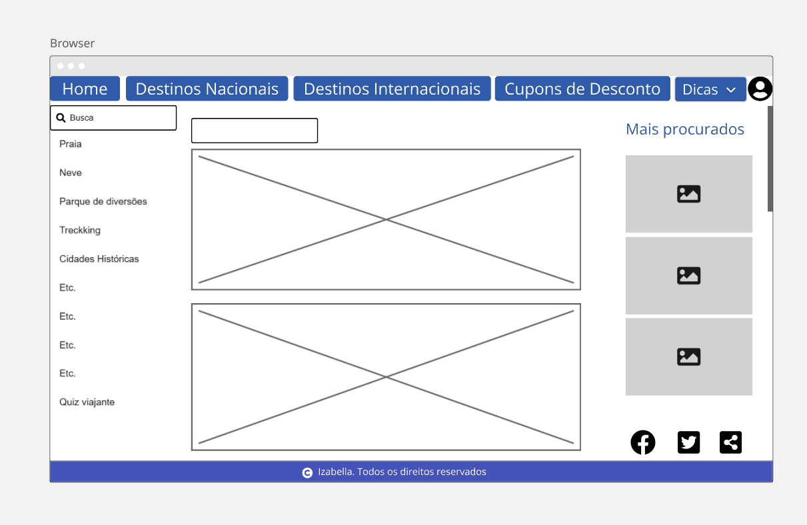
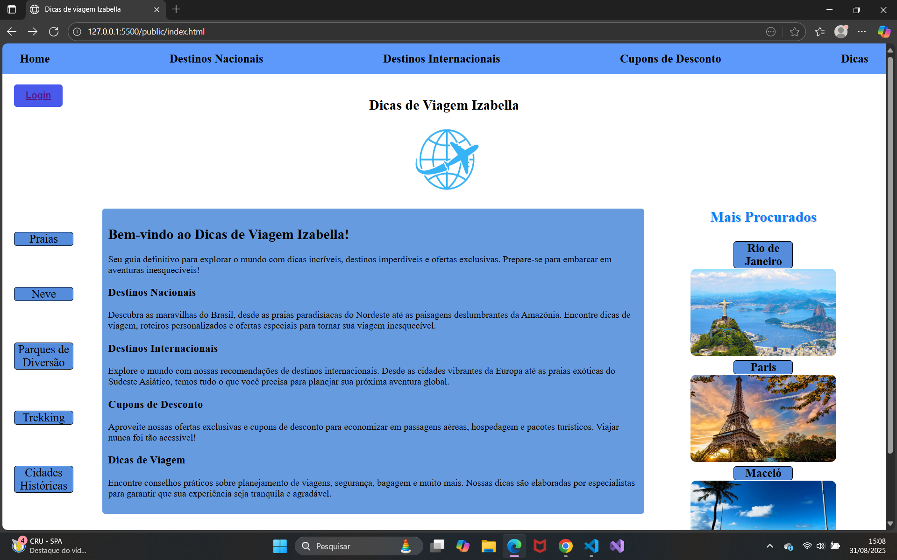
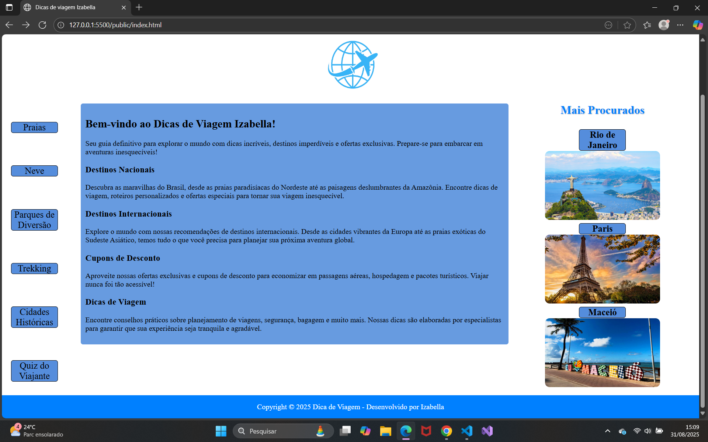

# Trabalho Prático - Semana 03

Dessa vez, vamos escolher uma proposta de projeto para trabalhar.

Nessa atividade, você deverá montar a página inicial do projeto escolhido, a organização do HTML aplicando semântica correta e uso aprimorado do CSS. Leia o enunciado completo no Canvas para mais detalhes.

**IMPORTANTE:** Você deve trabalhar e alterar apenas arquivos dentro da pasta **`public`**. Deixe todos os demais arquivos e pastas desse repositório inalterados. **PRESTE MUITA ATENÇÃO NISSO.**

## Informações Gerais

- Nome: Izabella Regina
- Matricula: 901340
- Proposta de projeto escolhida: Proposta 2
- Breve descrição sobre seu projeto: Web Page voltada para viajantes. Explanação sobre os lugares, dicas de passeios,experiência pessoal sobre lugares que já visitei, quiz para indicar destinos de viagem, dicas funcionais para viajantes (arrumar mala, checklist de viagem e ect.).

## Print do(s) wireframe(s) criado

## Print da home-page criada

